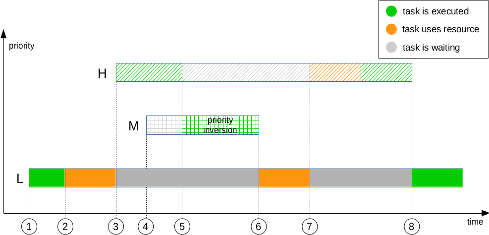
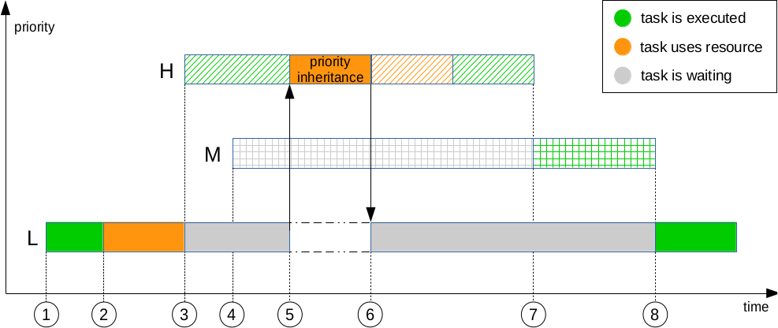

## 抢占式内核的主要特点

1. 临界区(critical sections)可抢占
2. 中断处理程序可抢占
3. 优先级继承机制
4. 延迟操作
5. 时延减少机制

###  1、临界区可抢占

  在抢找式的内核中，自旋锁(spinlock_t 和 rwlock_t)是可抢占的。这意味着当一个线程持有自旋锁时仍然是可以阻塞的，于是抢占一个锁是合法的。但是仍有一些临界的资源是不可抢占的，为了保持原有的自旋锁语义同时生效。补丁引入一个raw_spinlock_t 类型来代替不可抢占的自旋锁操作。

```c
 spinlock_t =>  raw_spinlock_t (不可抢占)
     						|  spinlock_t          (可抢占)
```


### 2、中断处理程序可抢占

  几乎所有的中断处理程序(interrupt handlers)都在进程上下文(process context)的环境下运行。中断可以设置SA_NODELAY标志来是其在中断上下文(iterrupt context)下进行。如果在中断上下文中进行，那么是不可抢占的。有些中断是必须在中断上下文中进行的，比如irq0表示时钟中断，该中断不可抢占。

  

### 3、优先级继承

  优先级继承机制主要用来解决优先级翻转的问题。考虑下图：



​                                                       图１　

- 一个优先级为L的低优先级任务task1 在 (1) 处开始执行
- task1 在 (2) 处获得互斥资源锁mutex
- 一个优先级为H的高优先级任务task2在 (3)处变得可运行，然后抢占了任务task1。task1开始阻塞。
- 第三个任务task3的优先级为M，在(4)处变得可以运行。但是它的优先级没有当前运行的任务task1的优先级高，因此不能够抢占，要等待其运行完。
- 在（5）处task2需要task1锁住的资源，于是task2停止运行直到锁可用。
- 在（5）处cpu会选择当前优先级较高且为ready状态的任务进行，于是选择task3，即优先级为M的任务。这时出现了优先级反转问题，因为H的任务必须等待M的任务运行完成并且L释放锁之后才能继续运行。一个高优先级任务必须要等待一个比优先级比它底且没有互斥资源相关的任务执行完后才能执行。这违背了抢占式内核的原则。


优先级继承是为了解决这个问题：



​                                                        图2

当H任务需要L的任务资源时，L的优先级会继承H的，提升至H。于是L任务会先于M进行释放相应的锁。

然后H获得锁执行完后才会执行任务M，最后执行最低优先级的任务L。


###　４、延迟操作

  在打上补丁后spin_lock()是可以阻塞的，也就是说可以调用sleep操作，于是在抢占和中断被禁止的情况下应该禁止调用它。为了延迟处理spin_lock()的调用需要一个缓冲队列：

- put_task_struct_delayed()会把一个需要调用spin_lock()的task加入队列。
- mmdrop_delayed() 把队列头的任务排出队列。
- 通过设置TIF_NEED_RESCHED_DELAYED的标志可以让调度器重新排列上述队列的顺序，保证高优先级的任务在前面。于是当抢占和中断允许时，会立即依次出队task进行后续的调度。


### 5、时延减少机制

....


### 参考资料
[A realtime preemption overview](https://lwn.net/Articles/146861/)