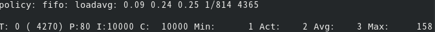
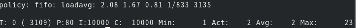
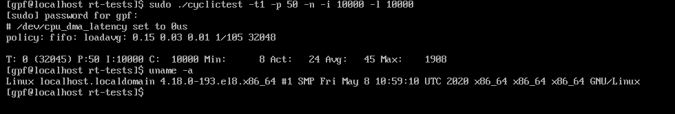
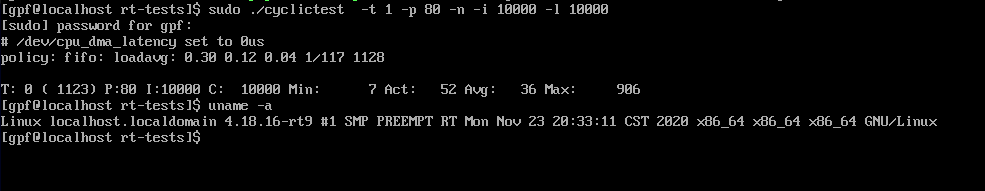
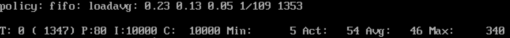
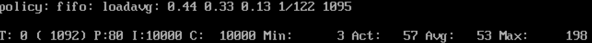
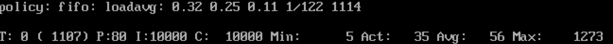

## cyclictest测试结果

cyclictest是一个测试工具，一般用来测试使用内核的延迟，从而判断内核的实时性。

测试所用的内核版本如下所示：

通用(GP-Linux):


实时(RT-Linux):


### 测试参数

测试选择的cyclictest命令如下:

```bash
sudo cyclictest -t1 -p 80 -n -i 10000 -l 10000
```

其中各参数的意义:

+ -t1 表示一个线程
+ -p 80 表示该线程的优先级为80
+ -n 表示使用clock_nanosleep
+ -i 10000 表示基本的线程间隔(us)
+ -l 10000 表示执行的循环个数(loops)为10000

具体的测试结果有4项需要观察:

| 参数 | 意义           |
| ---- | -------------- |
| Min  | 最小时延       |
| Act  | 最近一次的时延 |
| Avg  | 平均时延       |
| Max  | 最大时延       |

其单位都是us。


### 单独测试

对于单独的一个系统，打上实时补丁后会明显降低最大时延，结果如下：

GP-Linux:



打上实时补丁后的RT-Linux:



由此可以看出实时补丁能够提升内核的实时性，降低最大延迟。

****


### 对比测试

测试选择Guest和Host内核两两组合，有4种情况。测试结果如下表。这里只关注最大时延，单位us。

| host\guest | GP-Linux | RT-Linux  |
| ---------- | -------- | --------- |
| GP-Linux   | 340      | 198       |
| RT-Linux   | 199      | 1273(???) |

可以分析出以下结论：

1. 如果基座是通用linux，那么虚拟机打上实时补丁后会明显降低延迟，即实时的GuestOs效果较好。
2. 如果基座是实时linux，实时的虚拟机反而延迟更高，这里面也许有些问题。
3. 对于通用的虚拟机，GuestOs为GP-Linux的情况下，底座的实时性会提升测试的性能。

-----


### 同时运行

在RT-Linux的host上面同时运行两个虚拟机，一个是GP另一个是RT。两者同时测试的结果如下图所示：

GP-Linux:



RT-Linux:




可以看出两者同时运行的情况下，GP-Linux的时延为1908us，多于RT-Linux的时延906us。在多个虚拟机同时运行的情况下，实时的虚拟机的实时性更好。


### 附：测试的实际结果截图

1. Host为GP，Guest为GP:

   

2. Host为GP，Guest为RT:

   

3. Host为RT，Guest为GP:

   

4. Host为RT，Guest为RT:

   


## 参考链接

+ [cyclictest 简介](https://cloud.tencent.com/developer/article/1053954)