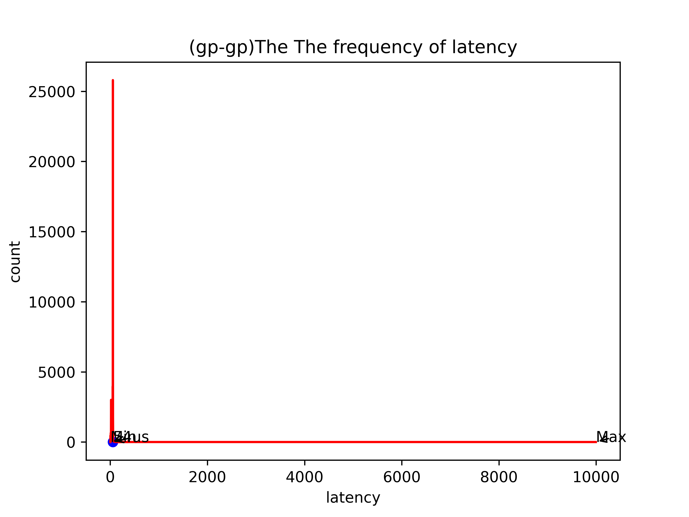

[TOC]

# KVM虚拟机与特定CPU的绑定

### 实验过程：


#### 查看当前内核启动时的命令参数：cat /proc/cmdline

#### 修改内核启动参数：

使用vim编辑器以root身份打开/etc/default/grub配置文件

在文件中找到以GRUB_CMDLINE_LINUX开头的行，在后面增加参数：isolcpus=2,3

保存并退出编辑

使用编辑后的默认文件重新生成GRUB2配置：

grub2-mkconfig -o /boot/grub2/grub.cfg

然后重启计算机

查看本次内核启动时的参数：cat /proc/cmdline

#### 查看宿主机是否隔离成功和当前各个cpu上运行的线程信息：

```c
ps -eLo ruser,pid,ppid,lwp,psr,args | awk '{if ($5==3) print $0}'
ps -eLo ruser,pid,ppid,lwp,psr,args | awk '{if ($5==2) print $0}'
ps -eLo ruser,pid,ppid,lwp,psr,args | awk '{if ($5==1) print $0}'
ps -eLo ruser,pid,ppid,lwp,psr,args | awk '{if ($5==0) print $0}'
ps -eLo psr | grep -e "^[[:blank:]]0$" | wc -l
ps -eLo psr | grep -e "^[[:blank:]]1$" | wc -l
ps -eLo psr | grep -e "^[[:blank:]]2$" | wc -l
ps -eLo psr | grep -e "^[[:blank:]]3$" | wc -l

```


根据输出信息可以看到cpu3-2上运行的进程和线程信息，分别有

migration线程：用于进程在不同CPU间迁移；

kworker线程：用于处理workqueues;

ksofttirqd线程：用于调度CPU软中断的进程；

watchdog:

cpuhp:

posixcputmr:

这些进程都是内核对各个CPU的守护进程。没有其他的普通进程在CPU2-3上运行，说明隔离是有效的。

#### 启动一个拥有俩个VCPU的客户机，并将其VCPU绑定到宿主机的CPU2-3上：

##### 启动客户机：


##### 查看客户机的VCPU线程：

##### 

##### 查看并改变客户机VCPU的处理器亲和性：


```c
ps -eLo ruser,pid,ppid,lwp,psr,args | gerp qemu | gerp -v grep
    
其中，
-e:显示所有进程
L: 显示所有线程
-o:以用户自定义的格式输出
ruser:运行进程的用户名
pid:进程id
ppid:父进程id
lwp:线程的id
psr：系统当前分配给进程运行的处理器编号    
args:运行的命令及其参数
```

### 实验结果：

##### CPU绑定之后的内核时延：

GP-GP:


GP-RT:


RT-GP:


RT-RT:


不同组合内核时延统计：

| 宿主机\客户机 | GP                                                    | RT                                                 |
| ------------- | ----------------------------------------------------- | -------------------------------------------------- |
| GP            | 717、399、448、226、158、238、333、205、334、131、162 | 474、242、232、258、231、187、363、294、521、242、 |
| RT            | 95、86、115、84、222、107、385、256、243、136         | 277、205、232、232、211、148、259、158、275、202   |


### 不同组合测试时延的频数统计

+ RT-RT

  

出现频率最高的时延是55us，一共出现了56次。


+ RT-GP


出现频率最高的时延是55us，一共出现了20334次。


+ GP-RT

  

出现频率最高的时延是54us，一共出现了29215次。


+ GP-GP
+  

出现频率最高的时延是54us，一共出现了25795次。

