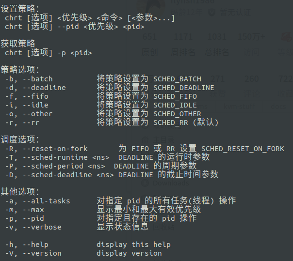
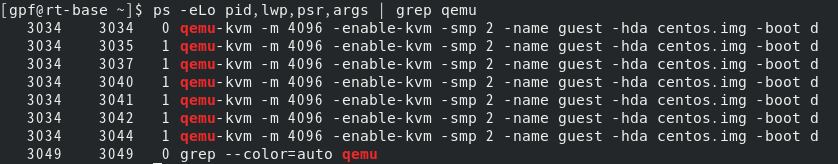
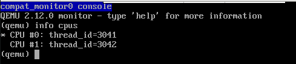
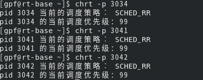

## 调度策略对cyclictest的影响

### 1、如和更换进程的调度策略

Linux中有的chrt命令可以改变某个进程或者线程的调度策略，具体的参数如下：




首先查看qemu-kvm的进程id(pid)：

```bash
ps -eLo pid,lwp,psr,args | grep qemu-kvm
```

结果如下图:




可以看到宿主机给启动该虚拟机的进程id是3034，该进程下又有几个线程，分别是3034~3049。从qemu启动后的debug信息(ctrl + shift + 2)可以查看该虚拟机的两个cpu的线程id是3041,3042，如下图所示(img2)。



因此需要修改进行和两个cpu线程与物理CPU的亲和性，用taskset修改，修改过程和上次汇报的一样。

然后用chrt命令修改进程和线程的调度策略。原来的调度策略是SCHED_OTHER,这里选择SCHED_RR，修改过程和结果如下图所示(img3):




可以看到修改后的总进程和两个cpu线程的调度策略发生了改变。


### 2、开始测试


+++++


## 参考资料

1、[Linux 更改进程调度](https://blog.csdn.net/flyfish1986/article/details/82225937)