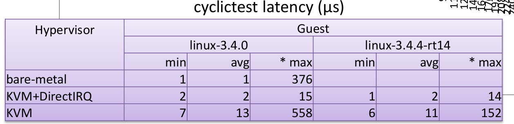

## 调度策略对cyclictest的影响

### 以下测试均是GP-RT的情境，Host为GP-Linux，Guest为RT-Linux.

### 1、如和更换进程的调度策略

Linux中有的chrt命令可以改变某个进程或者线程的调度策略，具体的参数如下：


首先查看qemu-kvm的进程id(pid)：

```bash
ps -eLo pid,lwp,psr,args | grep qemu-kvm
```

结果如下图:


可以看到宿主机给启动该虚拟机的进程id是3034，该进程下又有几个线程，分别是3034~3049。从qemu启动后的debug信息(ctrl + shift + 2)可以查看该虚拟机的两个cpu的线程id是3041,3042，如下图所示(img2)。


因此需要修改进行和两个cpu线程与物理CPU的亲和性，用taskset修改，修改过程和上次汇报的一样。

然后用chrt命令修改进程和线程的调度策略。原来的调度策略是SCHED_OTHER,这里选择SCHED_RR，修改过程和结果如下图所示(img3):


可以看到修改后的总进程和两个cpu线程的调度策略发生了改变。


### 2、开始测试

最普通的测试20次cyclictest的结果如下：

```bash
sudo cyclictest -t1 -p80 -n -i 10000 -l 10000
```

```bash
1:T: 0 ( 1865) P:80 I:10000 C:  10000 Min:      4 Act:   44 Avg:   47 Max:     165
2:T: 0 ( 1878) P:80 I:10000 C:  10000 Min:      4 Act:   53 Avg:   50 Max:     163
3:T: 0 ( 1888) P:80 I:10000 C:  10000 Min:     10 Act:   42 Avg:   53 Max:     207
4:T: 0 ( 1895) P:80 I:10000 C:  10000 Min:      6 Act:   54 Avg:   55 Max:     386
5:T: 0 ( 1902) P:80 I:10000 C:  10000 Min:     12 Act:   53 Avg:   53 Max:     114
6:T: 0 ( 1909) P:80 I:10000 C:  10000 Min:      4 Act:   52 Avg:   43 Max:      83
7:T: 0 ( 1930) P:80 I:10000 C:  10000 Min:      5 Act:   56 Avg:   52 Max:      83
8:T: 0 ( 1937) P:80 I:10000 C:  10000 Min:      5 Act:   15 Avg:   47 Max:     100
9:T: 0 ( 1944) P:80 I:10000 C:  10000 Min:      4 Act:   53 Avg:   51 Max:      86
10:T: 0 ( 1953) P:80 I:10000 C:  10000 Min:      5 Act:   52 Avg:   51 Max:      97
11:T: 0 ( 1961) P:80 I:10000 C:  10000 Min:      9 Act:   52 Avg:   51 Max:      77
12:T: 0 ( 1968) P:80 I:10000 C:  10000 Min:      4 Act:   54 Avg:   49 Max:      71
13:T: 0 ( 1977) P:80 I:10000 C:  10000 Min:      4 Act:   54 Avg:   44 Max:      75
14:T: 0 ( 1984) P:80 I:10000 C:  10000 Min:      5 Act:   52 Avg:   52 Max:      85
15:T: 0 ( 1992) P:80 I:10000 C:  10000 Min:      5 Act:   49 Avg:   48 Max:      87
16:T: 0 ( 1999) P:80 I:10000 C:  10000 Min:      3 Act:   55 Avg:   42 Max:      73
17:T: 0 ( 2008) P:80 I:10000 C:  10000 Min:      5 Act:   52 Avg:   44 Max:      84
18:T: 0 ( 2015) P:80 I:10000 C:  10000 Min:      4 Act:   54 Avg:   51 Max:      91
19:T: 0 ( 2023) P:80 I:10000 C:  10000 Min:      3 Act:    8 Avg:   46 Max:     199
20:T: 0 ( 2031) P:80 I:10000 C:  10000 Min:      5 Act:   61 Avg:   46 Max:     170

```

可以看到在20次测试中一共有<b>13</b>次最高时延低于100us，相比较与上次的结果有较大的提升。同时为了对比我们有更改了cyclictest的测试参数，分别增加了-m(mlockall）选项。在此基础上增加了一个更改虚拟机进程为SCHED_RR的对比实验。

mlock的参数意义如下所示:

```bash
-m       --mlockall        lock current and future memory allocations
```


6种测试的最大时延（us）如下表所示：

|      | normal | -m (mlockall) |
| ---- | ---------------- | ---- |
| SCHED_RR | 384    | 701 |
| SCHED_FIFO | 376    | 453 |

具体的测试结果如下面所示：

SCHED-RR - normal:

```bash

1:T: 0 ( 1865) P:80 I:10000 C:  10000 Min:      4 Act:   44 Avg:   47 Max:     165
2:T: 0 ( 1878) P:80 I:10000 C:  10000 Min:      4 Act:   53 Avg:   50 Max:     163
3:T: 0 ( 1888) P:80 I:10000 C:  10000 Min:     10 Act:   42 Avg:   53 Max:     207
4:T: 0 ( 1895) P:80 I:10000 C:  10000 Min:      6 Act:   54 Avg:   55 Max:     386
5:T: 0 ( 1902) P:80 I:10000 C:  10000 Min:     12 Act:   53 Avg:   53 Max:     114
6:T: 0 ( 1909) P:80 I:10000 C:  10000 Min:      4 Act:   52 Avg:   43 Max:      83
7:T: 0 ( 1930) P:80 I:10000 C:  10000 Min:      5 Act:   56 Avg:   52 Max:      83
8:T: 0 ( 1937) P:80 I:10000 C:  10000 Min:      5 Act:   15 Avg:   47 Max:     100
9:T: 0 ( 1944) P:80 I:10000 C:  10000 Min:      4 Act:   53 Avg:   51 Max:      86
10:T: 0 ( 1953) P:80 I:10000 C:  10000 Min:      5 Act:   52 Avg:   51 Max:      97
11:T: 0 ( 1961) P:80 I:10000 C:  10000 Min:      9 Act:   52 Avg:   51 Max:      77
12:T: 0 ( 1968) P:80 I:10000 C:  10000 Min:      4 Act:   54 Avg:   49 Max:      71
13:T: 0 ( 1977) P:80 I:10000 C:  10000 Min:      4 Act:   54 Avg:   44 Max:      75
14:T: 0 ( 1984) P:80 I:10000 C:  10000 Min:      5 Act:   52 Avg:   52 Max:      85
15:T: 0 ( 1992) P:80 I:10000 C:  10000 Min:      5 Act:   49 Avg:   48 Max:      87
16:T: 0 ( 1999) P:80 I:10000 C:  10000 Min:      3 Act:   55 Avg:   42 Max:      73
17:T: 0 ( 2008) P:80 I:10000 C:  10000 Min:      5 Act:   52 Avg:   44 Max:      84
18:T: 0 ( 2015) P:80 I:10000 C:  10000 Min:      4 Act:   54 Avg:   51 Max:      91
19:T: 0 ( 2023) P:80 I:10000 C:  10000 Min:      3 Act:    8 Avg:   46 Max:     199
20:T: 0 ( 2031) P:80 I:10000 C:  10000 Min:      5 Act:   61 Avg:   46 Max:     170

```

SCHED-RR - mlockall:

```bash
1:T: 0 ( 2081) P:80 I:10000 C:  10000 Min:      4 Act:   51 Avg:   49 Max:     285
2:T: 0 ( 2092) P:80 I:10000 C:  10000 Min:      5 Act:   53 Avg:   51 Max:     213
3:T: 0 ( 2100) P:80 I:10000 C:  10000 Min:      5 Act:   66 Avg:   50 Max:     279
4:T: 0 ( 2109) P:80 I:10000 C:  10000 Min:      4 Act:   54 Avg:   52 Max:     701
5:T: 0 ( 2116) P:80 I:10000 C:  10000 Min:      4 Act:   52 Avg:   51 Max:      69
6:T: 0 ( 2123) P:80 I:10000 C:  10000 Min:     15 Act:   54 Avg:   53 Max:      85
7:T: 0 ( 2130) P:80 I:10000 C:  10000 Min:      4 Act:   53 Avg:   50 Max:     125
8:T: 0 ( 2140) P:80 I:10000 C:  10000 Min:      4 Act:   51 Avg:   47 Max:      87
9:T: 0 ( 2148) P:80 I:10000 C:  10000 Min:      5 Act:   44 Avg:   49 Max:      64
10:T: 0 ( 2157) P:80 I:10000 C:  10000 Min:      5 Act:   52 Avg:   49 Max:      87
11:T: 0 ( 2164) P:80 I:10000 C:  10000 Min:      4 Act:    8 Avg:   32 Max:      72
12:T: 0 ( 2171) P:80 I:10000 C:  10000 Min:      4 Act:   51 Avg:   48 Max:      89
13:T: 0 ( 2178) P:80 I:10000 C:  10000 Min:      4 Act:   52 Avg:   49 Max:      68
14:T: 0 ( 2188) P:80 I:10000 C:  10000 Min:      4 Act:   52 Avg:   44 Max:      83
15:T: 0 ( 2196) P:80 I:10000 C:  10000 Min:      3 Act:   31 Avg:   38 Max:      90
16:T: 0 ( 2203) P:80 I:10000 C:  10000 Min:      5 Act:   67 Avg:   51 Max:      75
17:T: 0 ( 2212) P:80 I:10000 C:  10000 Min:      5 Act:   46 Avg:   51 Max:     100
18:T: 0 ( 2220) P:80 I:10000 C:  10000 Min:      4 Act:   31 Avg:   39 Max:      75
19:T: 0 ( 2238) P:80 I:10000 C:  10000 Min:      3 Act:   52 Avg:   50 Max:      87
20:T: 0 ( 2245) P:80 I:10000 C:  10000 Min:     11 Act:   51 Avg:   52 Max:     152
```

SCHED-FIFO - normal:

```bash
1:T: 0 ( 3258) P:80 I:10000 C:  10000 Min:      4 Act:   53 Avg:   50 Max:      91
2:T: 0 ( 3268) P:80 I:10000 C:  10000 Min:      3 Act:   54 Avg:   50 Max:     124
3:T: 0 ( 3275) P:80 I:10000 C:  10000 Min:      6 Act:   44 Avg:   52 Max:      95
4:T: 0 ( 3282) P:80 I:10000 C:  10000 Min:      4 Act:   31 Avg:   47 Max:     376
5:T: 0 ( 3291) P:80 I:10000 C:  10000 Min:      4 Act:   53 Avg:   47 Max:      90
6:T: 0 ( 3299) P:80 I:10000 C:  10000 Min:      3 Act:   56 Avg:   50 Max:     120
7:T: 0 ( 3307) P:80 I:10000 C:  10000 Min:      3 Act:   13 Avg:   12 Max:      93
8:T: 0 ( 3326) P:80 I:10000 C:  10000 Min:      4 Act:   54 Avg:   42 Max:     346
9:T: 0 ( 3337) P:80 I:10000 C:  10000 Min:      5 Act:   11 Avg:   45 Max:     108
10:T: 0 ( 3346) P:80 I:10000 C:  10000 Min:      5 Act:   55 Avg:   51 Max:      87
11:T: 0 ( 3353) P:80 I:10000 C:  10000 Min:      4 Act:   12 Avg:   43 Max:     111
12:T: 0 ( 3360) P:80 I:10000 C:  10000 Min:      6 Act:   54 Avg:   52 Max:     295
13:T: 0 ( 3368) P:80 I:10000 C:  10000 Min:      4 Act:   49 Avg:   51 Max:     177
14:T: 0 ( 3375) P:80 I:10000 C:  10000 Min:      5 Act:   33 Avg:   41 Max:      88
15:T: 0 ( 3384) P:80 I:10000 C:  10000 Min:      5 Act:   52 Avg:   54 Max:     334
16:T: 0 ( 3392) P:80 I:10000 C:  10000 Min:      4 Act:   53 Avg:   52 Max:      90
17:T: 0 ( 3399) P:80 I:10000 C:  10000 Min:      7 Act:   56 Avg:   52 Max:      85
18:T: 0 ( 3406) P:80 I:10000 C:  10000 Min:     10 Act:   55 Avg:   52 Max:     151
19:T: 0 ( 3415) P:80 I:10000 C:  10000 Min:      7 Act:   55 Avg:   52 Max:      85
20:T: 0 ( 3423) P:80 I:10000 C:  10000 Min:      5 Act:   59 Avg:   53 Max:      90
```

SCHED-FIFO - mlockall	:

```bash
1:T: 0 ( 3460) P:80 I:10000 C:  10000 Min:      4 Act:   47 Avg:   48 Max:     157
2:T: 0 ( 3470) P:80 I:10000 C:  10000 Min:      5 Act:   52 Avg:   43 Max:     187
3:T: 0 ( 3477) P:80 I:10000 C:  10000 Min:      5 Act:   97 Avg:   52 Max:     220
4:T: 0 ( 3484) P:80 I:10000 C:  10000 Min:      5 Act:   54 Avg:   56 Max:     453
5:T: 0 ( 3492) P:80 I:10000 C:  10000 Min:      5 Act:   53 Avg:   49 Max:     106
6:T: 0 ( 3499) P:80 I:10000 C:  10000 Min:      4 Act:   56 Avg:   47 Max:      88
7:T: 0 ( 3506) P:80 I:10000 C:  10000 Min:      5 Act:   54 Avg:   51 Max:      89
8:T: 0 ( 3515) P:80 I:10000 C:  10000 Min:      6 Act:   54 Avg:   52 Max:      91
9:T: 0 ( 3523) P:80 I:10000 C:  10000 Min:      5 Act:   47 Avg:   43 Max:     103
10:T: 0 ( 3530) P:80 I:10000 C:  10000 Min:      4 Act:   34 Avg:   40 Max:     119
11:T: 0 ( 3537) P:80 I:10000 C:  10000 Min:      5 Act:   53 Avg:   51 Max:      88
12:T: 0 ( 3544) P:80 I:10000 C:  10000 Min:      4 Act:   32 Avg:   40 Max:     267
13:T: 0 ( 3552) P:80 I:10000 C:  10000 Min:      5 Act:   53 Avg:   51 Max:     177
14:T: 0 ( 3561) P:80 I:10000 C:  10000 Min:      5 Act:   54 Avg:   53 Max:      87
15:T: 0 ( 3568) P:80 I:10000 C:  10000 Min:     10 Act:   53 Avg:   53 Max:     291
16:T: 0 ( 3576) P:80 I:10000 C:  10000 Min:      3 Act:   44 Avg:   44 Max:     107
17:T: 0 ( 3583) P:80 I:10000 C:  10000 Min:      4 Act:   49 Avg:   50 Max:     114
18:T: 0 ( 3592) P:80 I:10000 C:  10000 Min:      5 Act:   53 Avg:   46 Max:     233
19:T: 0 ( 3599) P:80 I:10000 C:  10000 Min:      3 Act:   56 Avg:   50 Max:     102
20:T: 0 ( 3607) P:80 I:10000 C:  10000 Min:      3 Act:   32 Avg:   40 Max:     176

```


具体的对比如如下图所示：


### 结论

修改进程调度策略后会有一定的改善，总体来说SCHED_RR的效果要总体好于SCHED_FIFO。但是开启-mlock后的差距并不是很大，需要进一步的学习其原理然后进行多次测试。


### 3、后续的问题

### （1）

[《Improvement of Real-time Performance of KVM》](https://github.com/xjtulab/kvm-stuff/blob/master/docs/reports/lcna_co2012_sekiyama.pdf) 这篇文档介绍了可以改善实时KVM的方法。


可以通过mlock和SCHED_RR以及CPU划分提升其效果，这在我们上面和之前的试验中已经尝试过。该文档还提出使用中断直通技术可以提升性能，但文中具体没有写到如何配置，我们需要在后续的试验中自己调试。

理想的结果如下图所示：




### （2）

还有一种调度策略 SCHED_DEADLINE没有进行尝试，该调度策略无法直接适用于进程，需要进行适量的修改。后续需要尝试该调度策略对实时VM的影响。


+++++


## 参考资料

1、[Linux 更改进程调度](https://blog.csdn.net/flyfish1986/article/details/82225937)

2、[《Improvement of Real-time Performance of KVM》](https://github.com/xjtulab/kvm-stuff/blob/master/docs/reports/lcna_co2012_sekiyama.pdf) 