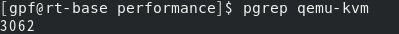
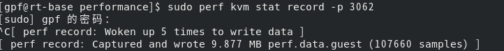
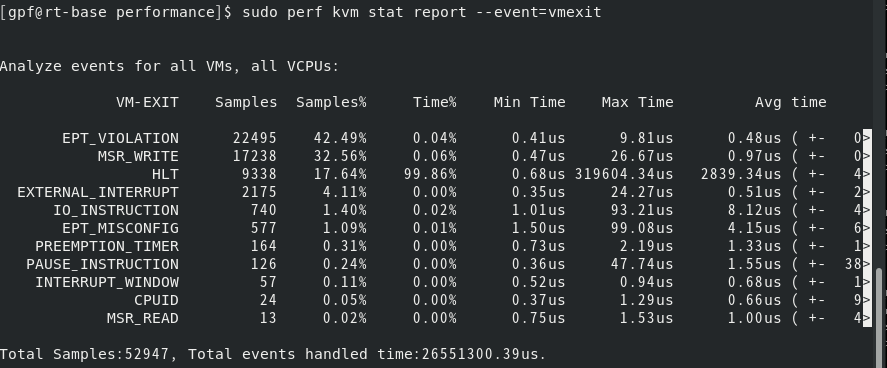
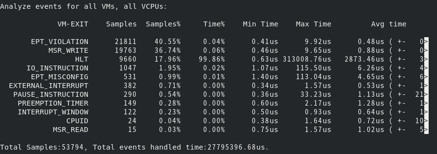
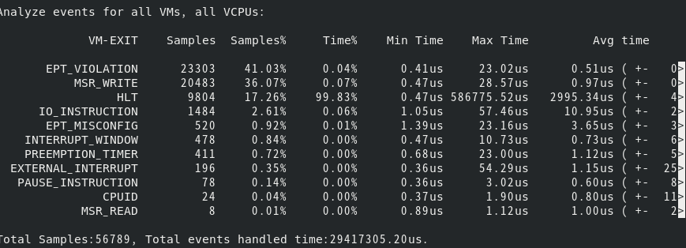

## 虚拟机退出次数测试

### 测试虚拟机退出(VMexit)的步骤

1. 首先需要找到qemu-kvm的进程

   ```bash
   pgrep qemu-kvm
   ```

   

   可知qemu-kvm的进程id为3062.

2. 使用perf命令开始记录虚拟机退出事件:

   ```bash
   sudo perf kvm stat record -p 3062
   ```

   该命令会开始记录虚拟机退出时间,同时不断地写入一个文件perf.data.guest,直到用ctrl+C发送信号停止记录,最后会生成一个文件,用来记录内容:

   


3. 使用perf report命令读取上面生成的文件然后生成汇总信息,命令如下:

   ```bash
   sudo perf kvm stat report --event=vmexit
   ```

   生成的结果如下图:

   


### VMExit统计字段

| 字段               | 意义 |
| ------------------ | ---- |
| EPT_VIOLATION      | EPT表缺页 |
| MSR_WRITE          | 写入MSR寄存器 |
| HLT                | 停机时间 |
| EXTERNAL_INTERRUPT | 外部中断 |
| IO_INSTRUCTION     | IO指令 |
| EPT_MISCONFIG      | EPT表的重新配置? |
| PREEMPTION_TIMER   | 抢占定时器 |
| PAUSE_INSTRUCTION  | 暂停指令 |
| INTERRUPT_WINDOW   | 中断窗口 |
| CPUID | 检测CPU |
| MSR_READ | 读取MSR寄存器 |

1. EPT是为了提升虚拟化内存映射的效率而提供的一项技术，打开EPT后，GuestOS运行时，通过页表转化处理的地址不再是真实的物理地址，而是被称作为guest-physical addressed,经过EPT的转化后才成为真实的物理地址。
2. MSR(Model Specific Register)指的是在x86架构处理器中，一系列用于控制CPU运行、功能开关、调试、跟踪程序运行、检测CPU性能方面的寄存器。
3. Preemption Timer是一种可以周期性使VM触发VMEXIT的一种机制。即设置了Preemption Timer之后，可以使得虚拟机在指定的TSC cycle之后产生一次VMEXIT并设置对应的exit_reason，trap到VMM中。


### 测试结果

该测试使用了两种组合方式，分别是GP-RT和GP-GP。且每种组合分别测试了是否绑定CPU的情况。一共四种，GuestOS执行的cyclictest指令如下：

```bash
sudo cyclictest -t1 -p 99 -i 10000 -l 1000
```

具体结果如下：

GP-GP-RAW:



GP-GP-BIND:


---

GP-RT-RAW:


GP-RT-BIND:



---


### 总结

1. 对于两种环境，绑定CPU后都会使IO_INSTRUCTION的处理次数变多，同时该事件的平均处理时间也会变长。
2. 绑定CPU会使MSR_WRITE的事件占比变多，但是处理时间基本不变。
3. GuestOS为RT时，绑定CPU后会使PREEMPTION_TIMER事件的占比变多(0.31% => 0.72%)。
4. GuestOS为RT时，绑定CPU后会使EXTERNAL_INTERRUPT事件的占比变少(4.11%  => 0.35%)。


### 后续工作

1. 以上四种情况cyclictest测试效果最好的是第四种，即GP-RT加入CPU绑定后，之前的实验已经说明了这一点。根据上面的总结可以看出，提升性能的主要手段有减少外部中断(EXTERNAL_INTERRUPT)，提升PREEMPTTION_TIMER的次数，同时多进行写入MSR寄存器的操作。根据数据这里面最主要的因素是外部中断的发生次数。

   | EXTERNAL_INTERRUPT | PREEMPTION_TIMER | MSR_WRITE |
   | :----------------: | :--------------: | :-------: |
   |         ↓          |        ↑         |     ↑     |

   

   


### 参考资料

1. [EPT学习总结及KVM的处理](https://blog.csdn.net/gudujianjsk/article/details/7735593)
2. [x86 CPU的MSR寄存器](https://www.pianshen.com/article/1100551186/)
3. [Intel VT技术中的Preemption Timer](https://blog.csdn.net/xelatex_kvm/article/details/17761415)
4. [KVM: perf: kvm events analysis tool](https://lwn.net/Articles/513317/)
