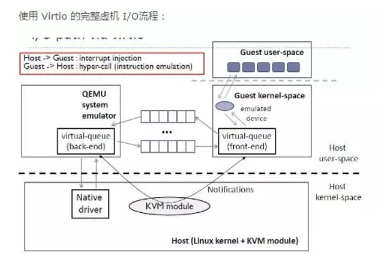

## 中断处理流程
1. qemu通过kvm的ioctl命令KVM_CREATE_IRQCHIP调用到kvm内核模块中，在内核模块中创建和初始化PIC/IOAPIC设备（创建设备对应的数据结构并将设备注册到总线上。

```c
kvm_arch_vm_ioctl(s, KVM_CREATE_IRQCHIP)
    |--> kvm_pic_init                    /* i8259 初始化 */
    |--> kvm_ioapic_init                 /* ioapic 初始化 */
    |--> kvm_setup_default_irq_routing   /* 初始化缺省的IRE */
```

​    KVM用中断路由表来保存中断向量：

```c
struct kvm_irq_routing_table {
    int chip[KVM_NR_IRQCHIPS][KVM_IRQCHIP_NUM_PINS];
    u32 nr_rt_entries;
    /*
        * Array indexed by gsi. Each entry contains list of irq chips
        * the gsi is connected to.
        */
    struct hlist_head map[0];  /* 哈希表数组 */
};
```

   虚拟机(VM)进行中断处理时一般需要从qemu的用户态进入内核态。最后会遍历每个vcpu，在满足条件时会为vcpu注入中断，然后让每个vpcu根据中断路由表执行中断。具体流程见：

https://luohao-brian.gitbooks.io/interrupt-virtualization/content/qemu-kvm-zhong-duan-xu-ni-hua-kuang-jia-fen-679028-4e2d29.html


2. 问题

   + 是否可以在guestos发起中断后(针对IO中断)，绕过vcpu的注入。因为IO中断需要访问物理设备，是否可以将vm与host的物理设备建立联系，从而加速中断的执行？
   + vcpu处理中断时，可能会访问hostos的资源。会有一个guestos到hostos的切换(VMExit),如何减少exit的次数与频率?
   + 关于RT-OS的中断处理流程与GP-OS的有所不同，要考虑中断的实时性，是否可以在GP-OS上修改中断的处理流程达到和RT-OS近似的效果?
   + RT-OS中断处理流程？


## IO相关


虚拟化面临物理IO设备有限的问题，比如物理网卡，在进行网络传输的时候资源受限。现存的机制有：Virtio机制。将物理的PCI设备进行抽象。

Virtqueue是传输层的抽象，用来交换数据。具体Virtio的IO流程如下图所示：



问题：

+ 关于IO具体的虚拟化我们可以直接使用该virtio框架，进行相应的IO配置，相对GP-OS和RT-OS来说，IO的映射划分可能会有不同。可以改进virtua-queue的请求方法吗？
+ ？？？


## 相关资料
1. [Kernelgo's KVM学习笔记](https://luohao-brian.gitbooks.io/interrupt-virtualization/content/)
2. [virtio简介](https://www.cnblogs.com/bakari/p/8309638.html)
3. 一种加速虚拟化中断的方式 《A Comprehensive Implementation and
Evaluation of Direct Interrupt Delivery》